## Hi there 👋

<!--
**ninuan/ninuan** is a ✨ _special_ ✨ repository because its `README.md` (this file) appears on your GitHub profile.

Here are some ideas to get you started:

- 🔭 I’m currently working on ...
- 🌱 I’m currently learning ...
- 👯 I’m looking to collaborate on ...
- 🤔 I’m looking for help with ...
- 💬 Ask me about ...
- 📫 How to reach me: ...
- 😄 Pronouns: ...
- ⚡ Fun fact: ...
-->

<picture>
  <source media="(prefers-color-scheme: dark)" srcset="https://raw.githubusercontent.com/ninuan/ninuan/output/github-contribution-grid-snake-dark.svg">
  <source media="(prefers-color-scheme: light)" srcset="https://raw.githubusercontent.com/ninuan/ninuan/output/github-contribution-grid-snake.svg">
  
</picture>

# Blog posts
<!-- BLOG-POST-LIST:START -->
- [Markdown配合图床上传图片到Github](http://hexo.1234211.xyz/article/239f2d00-2350-8099-b628-d32e9351be79)
<!-- BLOG-POST-LIST:END -->
